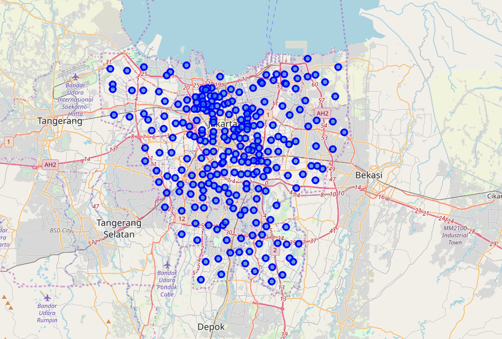
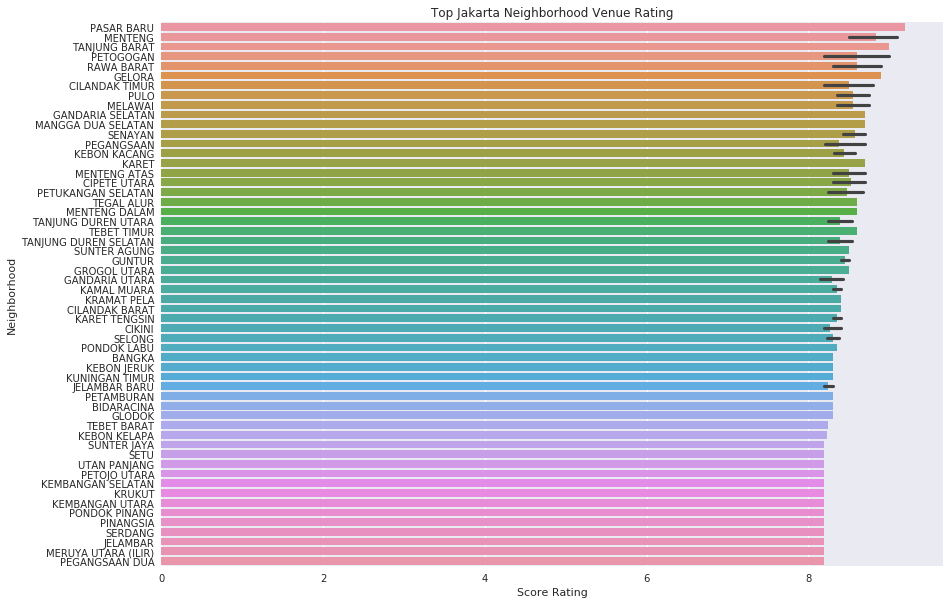
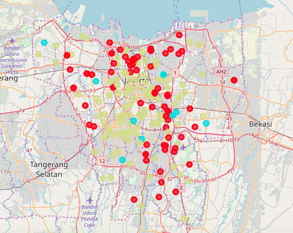

# Segmentation of Neighborhood, Jakarta.

The goal of this notebook is to provide data driven venue in Jakarta, Indonesia. The report should give an insight for traveler to understand the location on restaurant or any other activity in the area. Notebook contain several parts :

- Data Acquisition
- Cleanup
- Processing and visualization
- Segmentation and Clustering
- Conclusion

### Jakarta map

### Top Venue in Jakarta

### Jakarta Food Cluster

